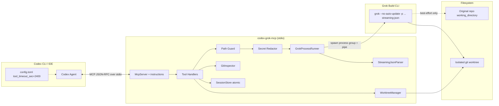
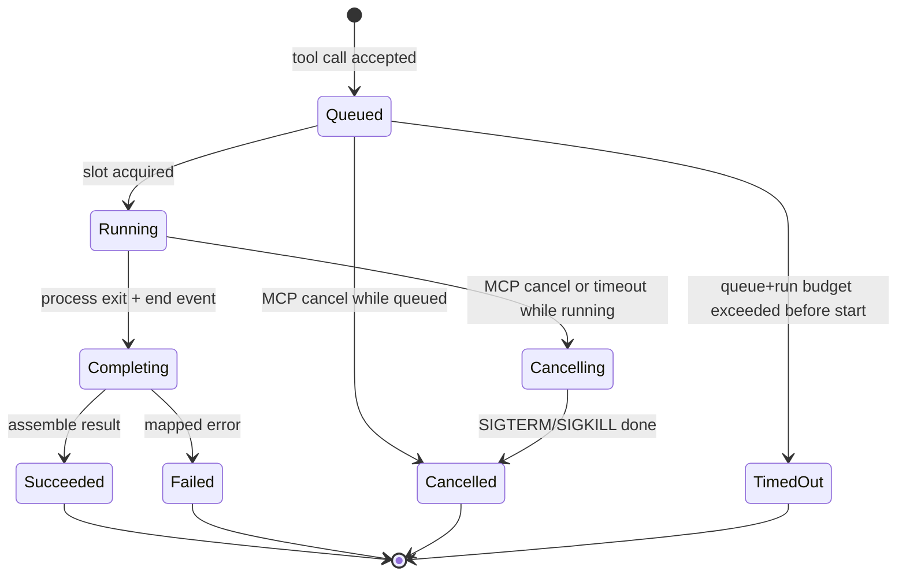

# Design Document: Codex ↔ Grok Build MCP Server (`codex-grok-mcp`)

| Field | Value |
|-------|-------|
| **Title** | Local MCP Server for Delegating Codex Work to Grok Build |
| **Author** | TBD |
| **Date** | 2026-07-29 |
| **Status** | Draft (revised after design review) |
| **Language** | TypeScript (Node.js ≥ 20) |
| **Transport** | stdio MCP |
| **Repo root** | `/ABSOLUTE/PATH/TO/GPTtoGrok` (greenfield) |
| **Verified Grok CLI** | `grok 0.2.112` (`~/.grok/bin/grok`), 2026-07-29 |

---

## Overview

Codex CLI and Codex IDE need a reliable way to **delegate coding work** (analyze, implement, review, debug, continue) to **Grok Build** without embedding Grok’s agent loop inside Codex. This project implements a **local stdio MCP server** that exposes five tools (`grok_analyze`, `grok_implement`, `grok_review`, `grok_debug`, `grok_continue`). Each tool spawns the Grok CLI in headless mode:

```bash
grok --no-auto-update -p <prompt> --output-format streaming-json [flags...]
```

The server parses **NDJSON streaming-json** events, enforces **path safety** and **secret redaction**, separates **read_only** vs **write_worktree** execution modes, and returns a structured result envelope (versioned JSON) including `summary`, `changed_files`, `diff`, `tests`, `session_id`, `worktree_path`, and `warnings`.

**Isolation is best-effort with layered mitigations**, not a hard OS guarantee. **v1 default write recipe** is: MCP creates a managed git worktree first, then spawns Grok with `--cwd <worktree_path>` (no `-w`) and `--sandbox workspace`, so the sandbox write root is the worktree—not the original tree—plus optional Edit/Write denies on `repo_root` when the worktree is outside it, and post-run original-tree dirty checks. Codex remains the outer orchestrator; Grok Build is the specialized coding backend.

**Critical Codex config**: long Grok runs require `tool_timeout_sec` far above Codex’s short default (commonly 60s in MCP hosts). The example config **must** set `tool_timeout_sec = 2400` (and a sensible `startup_timeout_sec`). Without this, almost every implement/debug call will be killed by Codex before the server timeout fires.

---

## Background & Motivation

### Current state

- Grok Build already supports headless single-prompt runs (`-p` / `--single`), streaming JSON, git worktrees (`-w` / `--worktree`), session resume (`-r` / `--resume`), tool allow/deny lists, permission modes, and sandbox profiles.
- Codex CLI/IDE can attach local MCP servers via `config.toml` and call tools during agent turns.
- There is no first-party bridge that maps Codex task intents to Grok Build with safe modes, structured results, and worktree isolation.

### Pain points without this server

1. Users must manually shell out to `grok`, parse streaming events, and copy diffs back into Codex.
2. Risk of Grok editing the primary working tree when Codex only wanted analysis.
3. Secrets (`.env`, keys, `auth.json`) may leak into prompts, diffs, or logs.
4. No uniform cancel/timeout semantics across long-running Grok sessions.
5. Session continuity (`session_id` → resume) is ad hoc.
6. Codex MCP hosts often impose short per-tool timeouts unless configured.

### Opportunity

A thin, well-tested MCP adapter reuses Grok’s mature agent, tools, and worktree management while giving Codex a **contractual tool surface** with predictable schemas and safety defaults.

---

## Goals & Non-Goals

### Goals

1. Expose five MCP tools that map cleanly to analyze / implement / review / debug / continue workflows.
2. Run Grok exclusively via the required headless pattern plus documented extra flags.
3. Support explicit **absolute** `working_directory` with **realpath resolution**, **case-aware root checks on Darwin**, and **path traversal prevention**.
4. Enforce **read_only** vs **write_worktree** mode separation via tool allow/deny lists as the primary control.
5. For write modes: run in an **isolated git worktree** with **best-effort isolation** via the default recipe (create managed worktree first → `--cwd` worktree + `--sandbox workspace` + conditional Edit/Write denies + original-tree dirty detection); do not treat isolation as absolute.
6. Return versioned structured results: `summary`, `changed_files`, `diff`, `tests`, `session_id`, `worktree_path`, `warnings`.
7. Support **timeouts** and **MCP cancellation** with a documented process-group kill state machine (SIGTERM → SIGKILL).
8. Correctly handle stderr, non-zero exit codes (including 130/143), and streaming-json event types.
9. Redact secrets from **summary**, diffs, stderr tails, and test outputs using high-confidence path rules + regex.
10. Ship README, AGENTS.md, tests, and a **dogfood-ready** `examples/codex-config.toml` that includes **`tool_timeout_sec`** and **`startup_timeout_sec`**.
11. Provide a clear **consumer workflow** for applying worktree diffs back into the user’s tree via Codex.

### Non-Goals

1. Re-implementing Grok’s agent loop, tools, or TUI.
2. Remote/network MCP transport (Streamable HTTP) in v1 — **stdio only**.
3. Managing xAI authentication (`grok login`); assume the host machine is already authenticated.
4. Multi-tenant hosting or untrusted multi-user sandboxing beyond local developer use.
5. Automatic PR creation / push to remotes (Grok may do this if allowed; MCP does not orchestrate it).
6. Full parity with every Grok CLI flag; only flags needed for safety and the five tools.
7. Windows as a primary target in v1 (design should not block it; CI may start with macOS/Linux).
8. Perfect secret DLP (best-effort redaction only).
9. Automatically merging worktree changes into the original tree (Codex/user applies results).

---

## Consumer workflow (Codex ↔ worktree artifacts)

After a successful write tool (`grok_implement`, `grok_debug`, or `write_worktree` continue):

1. Codex reads **first-class** fields `worktree_path`, `changed_files`, and `diff` from the tool result.
2. Recommended apply paths (pick one; document in tool descriptions + server `instructions`):
   - **Review then apply**: show `diff` to the user; on approval, `git -C <original> apply` from the patch, or copy files from `worktree_path` for listed `changed_files`.
   - **Worktree checkout / cherry-pick**: if the worktree has commits, cherry-pick or merge the worktree branch into the original branch (advanced; not automated by MCP).
   - **Open paths**: open files under `worktree_path` for manual review in the IDE.
3. Codex **must not** assume the original tree was modified. If `warnings` contains `ORIGINAL_TREE_DIRTY`, treat as a safety event and stop auto-apply.
4. To iterate: call `grok_continue` with the returned `session_id` (and same `working_directory`); do not create a new worktree unless starting a new implement/debug.

Server `instructions` (MCP initialize) and each write-tool description must state this workflow explicitly so Codex does not re-implement from `summary` alone or shell-copy blindly.

---

## Proposed Design

### High-level architecture



### Component responsibilities

| Component | Responsibility |
|-----------|----------------|
| `src/server.ts` | MCP server bootstrap, `instructions`, tool registration, annotations, stdio transport |
| `src/tools/*.ts` | Per-tool schemas, descriptions, mode defaults, prompt scaffolding |
| `src/path-guard.ts` | Absolute path requirement, realpath, Darwin case-fold, allowlist check |
| `src/redact.ts` | High-confidence secret path filtering + regex on text outputs |
| `src/grok-runner.ts` | Spawn `grok`, env scrubbing, queue, timeout, cancel state machine |
| `src/streaming-json.ts` | NDJSON parser for `text` / `thought` / `end` / `error` / other |
| `src/git.ts` | status, frozen diff algorithm, rev-parse, worktree discovery |
| `src/worktree.ts` | Hybrid create/discover/cleanup + edge-case table |
| `src/session-store.ts` | Atomic locked `sessions.json` |
| `src/result.ts` | Assemble versioned `GrokToolResult` |
| `src/config.ts` | Env + optional config: allow roots, tool IDs, binary path |
| `src/types.ts` | Shared TypeScript types and Zod schemas |
| `src/tool-ids.ts` | Canonical Grok tool ID constants (both shell aliases, Agent, etc.) |

### Process lifecycle (per tool call)



```mermaid
sequenceDiagram
  participant C as Codex
  participant M as MCP Server
  participant G as grok process group
  participant FS as Git worktree / repo

  C->>M: tools/call
  M->>M: validate args (Zod)
  M->>M: resolve absolute working_directory
  alt write_worktree
    M->>FS: snapshot original git status (baseline)
    M->>FS: git worktree add (managed path) BEFORE spawn
    M->>M: worktree_path known; decide Edit/Write denies
  end
  M->>G: spawn --cwd worktree_path (no -w) + sandbox workspace
  par stream
    G-->>M: NDJSON text/thought/error/...
  and cancel path
    C-->>M: notifications/cancelled OR AbortSignal OR timer
    M->>G: SIGTERM process group
    M->>G: wait grace_ms then SIGKILL group
  end
  G-->>M: end + exit code (or killed)
  M->>FS: discover worktree path; git status/diff in effective cwd
  opt write_worktree
    M->>FS: compare original repo status vs baseline
  end
  opt test_command
    M->>FS: run tests in effective_cwd
  end
  M->>M: redact; build GrokToolResult v1
  M-->>C: result or structured error
```

### Execution modes

#### Canonical tool ID constants (`src/tool-ids.ts`)

Grok docs disagree on shell tool naming (`run_terminal_cmd` in headless docs vs `run_terminal_command` in getting-started). **v1 denies both**, and centralizes IDs:

```typescript
export const READ_ONLY_TOOLS = [
  "read_file",
  "grep",
  "list_dir",
] as const;

// Intentionally NOT including search_tool / MCP meta-tools in the allowlist.
// MCP meta-tools may still exist unless denied; deny them explicitly below.

export const WRITE_AND_ESCAPE_TOOLS = [
  "search_replace",
  "write",
  "run_terminal_cmd",      // headless docs ID
  "run_terminal_command",  // getting-started / hooks alias (deny both)
  "Agent",                 // subagent escape hatch
  // Optional: image/gen tools if treated as mutating in future
] as const;

export const READ_ONLY_DISALLOWED = [
  ...WRITE_AND_ESCAPE_TOOLS,
  // MCP meta-tool family if denylist supports it; also use --no-subagents
] as const;
```

Config may override lists; unit tests pin that **both** shell IDs are always present in the default denylist **and cannot be removed** by caller overrides (mandatory denies form a union with any extra caller IDs).

#### `read_only` — canonical policy (primary = tool filters)

**Effective cwd**: resolved absolute `working_directory` (original tree).  
**No worktree created.**

Effective `read_only` (default for `grok_analyze` / `grok_review`, optional on `grok_debug` / `grok_continue`) is **fail-closed**:

| Control | Behavior |
|---------|----------|
| **Tool allowlist** | Default `--tools read_file,grep,list_dir`. Caller `tools` may only **narrow** that list (intersection). Mutating/unknown IDs are dropped. Empty override or empty intersection falls back to the safe allowlist (never omits `--tools`, which would open all tools). |
| **Tool denylist** | Always includes mandatory IDs: `search_replace`, `write`, **both** shell names (`run_terminal_cmd`, `run_terminal_command`), and `Agent`. Caller `disallowed_tools` can only **add** more IDs; mandatory denies **cannot** be removed (union). |
| **Subagents** | Always `--no-subagents` in read_only — even if `allow_subagents: true`. |
| **Permission mode** | Forced `--permission-mode dontAsk`. Caller values `bypassPermissions`, `acceptEdits`, `auto`, and `default` are rejected (`GROK_MCP_INVALID_ARGS`). |
| **Sandbox** | Default `read-only`. Caller `sandbox=off` or `sandbox=workspace` is rejected (`GROK_MCP_INVALID_ARGS`). |
| **`test_command`** | Rejected in effective read_only (`GROK_MCP_INVALID_ARGS`). Allowed only when the **effective** mode is `write_worktree`. |
| **Web** | Off unless `allow_web: true` (`--disable-web-search` otherwise). |

**Primary controls (required defaults)**:

```text
--tools "read_file,grep,list_dir"
--disallowed-tools "search_replace,write,run_terminal_cmd,run_terminal_command,Agent"
--no-subagents
--permission-mode dontAsk
--sandbox read-only
--deny "Read(**/.env)"
--deny "Read(**/.env.*)"
--deny "Read(**/*.pem)"
--deny "Read(**/id_rsa)"
--deny "Read(**/id_ed25519)"
--deny "Read(**/auth.json)"
```

**Secondary notes**:

- Permission-mode is forced to `dontAsk` (not `plan`). CLI `--permission-mode plan` is compatibility-oriented and is **not** a filesystem freeze; engineers must not treat it as one.
- Unsafe caller overrides for `permission_mode` / `sandbox` are **rejected**, not silently ignored.

**Web tools**: default **off** for read_only (`web_search` / `web_fetch` not in allowlist). Prefer `--disable-web-search` unless `allow_web: true`. Caller `tools` may only **narrow** the safe allowlist (see table above).

**Post-run**: if `changed_files`/`diff` non-empty under original tree → `warnings` includes `UNEXPECTED_MUTATION` (high severity text in summary prefix).

#### `write_worktree` — best-effort isolation

**Contract wording (v1)**:  
> Writes are directed at an isolated git worktree. Isolation is **best-effort**. Absolute-path edits, shell escapes, or missing/broken sandbox can still touch the original tree. MCP applies the **default write recipe** below and reports `ORIGINAL_TREE_DIRTY` if the original tree changes.

##### Default write recipe (v1 — single implementable path)

Grok’s `workspace` sandbox grants **write access to process CWD** (+ `~/.grok/` + temp). Therefore **spawn CWD must be the worktree**, not the original tree. Spawning `--cwd <original> -w <name> --sandbox workspace` is **incorrect by construction** (original stays writable; external worktree may be blocked).

**v1 default = create worktree first, then spawn into it (no `-w`):**

| Step | Action |
|------|--------|
| A | Resolve absolute `working_directory`; require git repo → `repo_root` |
| B | Snapshot original `git status --porcelain=v1` at `repo_root` (baseline) |
| C | Allocate `worktree_name` (`codex-grok-{tool}-{8hex}` or caller-provided; collision → `GROK_MCP_WORKTREE_EXISTS`) |
| D | **Create worktree before any Grok spawn**: `git -C <repo_root> worktree add -b codex-grok/<name> <managed_path> <ref>` where `managed_path = ~/.cache/codex-grok-mcp/worktrees/<repo_hash>/<name>` and `<ref>` = `worktree_ref` or `HEAD`. On failure → `GROK_MCP_WORKTREE_CREATE_FAILED` |
| E | `worktree_path = realpath(managed_path)` — known **before** spawn |
| F | Optionally append to durable `pending_worktrees` (see session store) so crash orphans are listed without waiting for `end` |
| G | Build deny list (rules below) |
| H | Spawn Grok with `--cwd <worktree_path>` **without** `-w`, `--sandbox workspace` (unless overridden), secret Read denies, Edit/Write denies when safe, `--always-approve`, `--no-subagents` |
| I | On `end` / exit: collect diff from worktree; re-check original baseline; persist session map with `session_id` |

**Why not default Grok `-w`:** unverified whether Grok rebinds sandbox CWD after creating a worktree. Until proven, MCP owns worktree creation so sandbox CWD == write target.

**Opt-in Grok-native `-w` path** (`GROK_MCP_USE_GROK_WORKTREE=1` or `use_grok_worktree: true`):

- Spawn `--cwd <repo_root> -w <name> [--worktree-ref]` with **`sandbox=off`** (default for this path — do **not** claim workspace jails the worktree).
- Rely on post-run `ORIGINAL_TREE_DIRTY` + tool policy; discovery poll after spawn for `worktree_path`.
- Document as weaker isolation; not the dogfood default.

##### Mitigations (all applied on the default recipe)

1. **Process CWD = worktree** before Grok starts (step H). Relative edits and `workspace` sandbox writes land in the worktree.
2. **Edit/Write deny rules — hard rule** (compute after `worktree_path` is known):

   ```text
   function shouldDenyRepoRootWrites(repo_root, worktree_path): boolean {
     // Emit Edit/Write denies on repo_root ONLY when worktree is NOT under repo_root.
     // If worktree is a prefix-child of repo_root, denies would block legitimate edits.
     return !isPathInside(worktree_path, repo_root); // Darwin: case-fold
   }
   ```

   - If `shouldDenyRepoRootWrites` → pass:
     ```text
     --deny "Edit(<repo_root>/**)"
     --deny "Write(<repo_root>/**)"
     ```
     (Use absolute realpaths in the rule strings as Grok expects path patterns.)
   - If worktree is **inside** `repo_root` **or** path unknown → **omit** repo_root Edit/Write denies entirely; rely on `--sandbox workspace` with CWD=worktree + `ORIGINAL_TREE_DIRTY`.
   - Default managed path under `~/.cache/...` is **outside** `repo_root` → denies **are** emitted on the default recipe.
   - Never emit a deny that matches `worktree_path/**`.
   - Unit/integration fixtures: “worktree outside repo” (denies on) vs “worktree inside repo” (denies off).

3. **Sandbox**: default `--sandbox workspace` on the default recipe (`GROK_MCP_SANDBOX` unset). Set `off` only via config/env. On Grok-`-w` opt-in path, default sandbox is **`off`**. Original tree remains **readable**; writes outside CWD blocked when sandbox active.
4. **Original-tree baseline** (step B / post-run): if new dirt at `repo_root` beyond git worktree bookkeeping metadata → `warnings: ["ORIGINAL_TREE_DIRTY"]` + redacted `meta.original_tree_status`. `GROK_MCP_FAIL_ON_ORIGINAL_DIRTY=1` → error `GROK_MCP_ORIGINAL_TREE_DIRTY`.
5. **`--no-subagents`**: always on in **effective `read_only`** (caller `allow_subagents: true` ignored). In `write_worktree`, default on unless `allow_subagents: true`.
6. **Auto-approve**: `--always-approve` (write modes).
7. **Secret Read denies** (always): `--deny "Read(**/.env)"` etc.

**Post-run git inspection**: `changed_files` / `diff` from the worktree (`effective_cwd = worktree_path`). Original tree only for dirty warning.

### Worktree strategy (Hybrid — Option C, isolation-correct default)

**Decision**: Hybrid with **MCP-managed `git worktree add` as the v1 default create path** (correct with `--sandbox workspace`), Grok-native `-w` as **opt-in weaker mode**, unified session map + TTL GC.

#### Create flow (`write_worktree`) — default recipe detail

1. Resolve and validate **absolute** `working_directory`; require git repo (`git rev-parse --show-toplevel`) → else `GROK_MCP_NOT_A_GIT_REPO` with message: “write_worktree requires a git repository; init git or use grok_analyze”.
2. Snapshot original `git status --porcelain=v1` baseline at `repo_root`.
3. Allocate worktree name:
   - If `worktree_name` provided: validate `[A-Za-z0-9._-]+`, max 64 chars; if collision with existing git worktree path/branch → error `GROK_MCP_WORKTREE_EXISTS` (no silent reuse).
   - Else generate `codex-grok-{tool}-{8 hex}` and retry up to 3 times on collision.
4. **Create managed worktree** (before spawn):
   ```bash
   mkdir -p ~/.cache/codex-grok-mcp/worktrees/<repo_hash>
   git -C <repo_root> worktree add \
     -b "codex-grok/<worktree_name>" \
     ~/.cache/codex-grok-mcp/worktrees/<repo_hash>/<worktree_name> \
     <worktree_ref|HEAD>
   ```
   `worktree_path = realpath(...)`. Store `managed_fallback: true` (name kept for schema; this is the default path, not a fallback).
5. Compute Edit/Write denies via `shouldDenyRepoRootWrites` (true for default managed location).
6. Spawn Grok:
   ```text
   --cwd <worktree_path>   # NOT repo_root
   # no -w
   --sandbox workspace
   --always-approve --no-subagents
   --deny Read secrets...
   [--deny Edit/Write repo_root if shouldDenyRepoRootWrites]
   ```
7. **Session / crash durability**:
   - In-memory `run_id` record holds `worktree_path` from step 4 immediately.
   - Optional durable `pending_worktrees[]` written when path is first created (nice-to-have; recommended in PR 6).
   - Full session map entry with `session_id` is written on `end` (when Grok returns `sessionId`).
   - **If MCP crashes after create but before `end`**: durable `sessions.json` may lack the entry; orphans are reaped by TTL GC via `git worktree list` under managed roots and/or `pending_worktrees`, not solely via sessions.json. `grok worktree gc` is secondary (Grok-native trees only).

#### Worktree edge cases (decision table)

| Case | Behavior |
|------|----------|
| **Dirty original tree (WIP uncommitted)** | Proceed. Worktree is based on `worktree_ref` or HEAD **commit**, so **uncommitted WIP is not present** in the worktree. `warnings` includes `ORIGINAL_WIP_NOT_IN_WORKTREE`. Prompt scaffolding mentions this. Callers needing WIP must commit/stash first or pass a ref that contains it. |
| **`worktree_name` collision** | Fail `GROK_MCP_WORKTREE_EXISTS`; do not overwrite. |
| **Continue write** requires **stored** session with `mode=write_worktree`, **`managed: true`**, and a worktree that is under the managed cache root, **registered** via `git worktree list` for the **same repo** as `working_directory`, and not the original repo root. Unmanaged / unregistered / cross-repo paths → `GROK_MCP_WORKTREE_INVALID`. |
| **Continue, worktree path missing** + resolved mode **write_worktree** | **Fail closed** → `GROK_MCP_WORKTREE_MISSING`. Do **not** fall back to original cwd for writes. |
| **Continue, worktree missing** + explicit `mode=read_only` | Proceed read_only with `--cwd working_directory`. |
| **Continue, worktree missing** + `allow_missing_worktree=true` + **no** explicit `mode=write_worktree` | **Downgrade** to read_only; `warnings: ["MODE_DOWNGRADED_MISSING_WORKTREE"]`; cwd=`working_directory`. |
| **Continue** + explicit `mode=write_worktree` + `allow_missing_worktree=true` | **`GROK_MCP_INVALID_ARGS`** — conflicting flags (never silent downgrade when write was requested). |
| **Continue, optional caller `worktree_path`** | Must **exactly match** stored path (realpath); mismatch → `GROK_MCP_WORKTREE_INVALID`. |
| **Continue, session unknown to MCP store** | Write mode without store entry → `GROK_MCP_SESSION_NOT_FOUND` (unmapped write sessions are rejected). read_only or `allow_unmapped_session=true` may attempt `grok -r` with `--cwd working_directory`. |
| **Concurrent runs same repo** | Allowed; distinct worktree names/paths. Session store uses file lock + atomic write. |
| **Cancel after worktree create** | Kill process group; worktree path already known — keep unless `keep_worktree=false` (then best-effort remove on both success and failure paths); orphans eligible for TTL GC via `pending_worktrees`. |
| **`keep_worktree`** | Single param (default `true`). `false` → best-effort worktree removal after the run completes (success **or** failure). If removal fails, the `pending_worktrees` entry is kept so GC can retry. **No** `cleanup_worktree` alias. |
| **Cleanup IDs** | Prefer `git worktree remove --force <worktree_path>` for managed trees; store path always. Grok worktree id only for opt-in `-w` path. |
| **Managed worktree location** | `~/.cache/codex-grok-mcp/worktrees/<repo_hash>/<name>` (outside repo_root). TTL GC walks this tree. |
| **Non-git directory** | write tools → `GROK_MCP_NOT_A_GIT_REPO`; analyze/review read_only OK. |
| **Opt-in Grok `-w` create failure** | `GROK_MCP_GROK_ERROR`; do not auto-flip sandbox on without recreating via managed path. |

#### Cleanup policy

| Trigger | Action |
|---------|--------|
| `keep_worktree: false` after run ends | Remove via `git worktree remove` on success **and** failure; keep `pending_worktrees` if removal did not actually clear the path |
| TTL (default **72h** since `last_used_at`) | GC on **server start only** (not after tool calls); **never GC sessions with `running=true`**; only remove validated managed worktrees (absolute realpath under managed cache root, registered via `git worktree list`, `managed === true`) |
| Process exit | Default: keep; `GROK_MCP_CLEANUP_ON_EXIT=1` best-effort remove process-created trees |
| Manual | README: `grok worktree list`, `grok worktree rm <id>`, `grok worktree gc --max-age 72h` |

### Tool semantics

| Tool | Default mode | Resume | Typical use |
|------|--------------|--------|-------------|
| `grok_analyze` | `read_only` | no | Explore codebase, answer questions |
| `grok_implement` | `write_worktree` | no | Feature/fix in isolated worktree |
| `grok_review` | `read_only` | no | Code review; MCP injects redacted `git diff` vs `base_ref` |
| `grok_debug` | `write_worktree` | no | Debug/fix in worktree; may set `mode=read_only` |
| `grok_continue` | inherit | **yes** (`-r`) | Follow-up; **never** pass `-w` on continue |

#### Prompt scaffolding

- **analyze**: read-only analysis; do not modify files.
- **implement**: implement change in the session worktree; minimal diffs; note WIP not included from original dirty tree.
- **review**: review the provided diff + codebase; list issues by severity; do not modify unless mode write.
- **debug**: hypotheses, evidence, fix if clear.
- **continue**: user prompt; re-apply mode rules via `--rules` if needed.

`--verbatim` only when `verbatim: true`.

#### Review diff injection (Key Decision)

Default **`base_ref = "HEAD"`** (no upstream / `HEAD~` heuristics). Callers pass `main`, `origin/main`, or a PR base for branch-style reviews.

When `inject_diff` is true (default), MCP runs:

```bash
git -C <working_directory> diff --stat <base_ref>
git -C <working_directory> diff <base_ref>
```

Secret-path **whole hunks** and **stat rows** are filtered/omitted (not merely content-redacted in place). Cap at `GROK_MCP_MAX_PROMPT_DIFF_BYTES` (default 256 KiB), attach to prompt under a clear fence:

```text
## Diff vs {base_ref} (server-injected, may be truncated)
```

If diff empty, note “no diff vs base_ref” and still allow review of named files in prompt.

### Grok CLI invocation builder

```typescript
function buildGrokArgv(opts: GrokRunOptions): string[] {
  const argv: string[] = [
    "--no-auto-update",
    "-p", opts.prompt,
    "--output-format", "streaming-json",
    "--cwd", opts.cwd,
  ];

  // Default write recipe: worktree already created; opts.cwd === worktree_path; do NOT pass -w.
  // Opt-in Grok-native only: opts.useGrokWorktree && !opts.resumeSessionId
  if (opts.useGrokWorktree && opts.worktreeName && !opts.resumeSessionId) {
    argv.push("-w", opts.worktreeName);
    if (opts.worktreeRef) argv.push("--worktree-ref", opts.worktreeRef);
  }

  if (opts.resumeSessionId) {
    argv.push("-r", opts.resumeSessionId);
    // Do not pass --restore-code by default (would checkout old commit).
    // Optional opts.restoreCode → --restore-code
  }

  if (opts.maxTurns != null) argv.push("--max-turns", String(opts.maxTurns));
  if (opts.model) argv.push("-m", opts.model);
  // opts.reasoningEffort?: string
  if (opts.reasoningEffort) argv.push("--reasoning-effort", opts.reasoningEffort);

  if (opts.tools?.length) argv.push("--tools", opts.tools.join(","));
  if (opts.disallowedTools?.length) {
    argv.push("--disallowed-tools", opts.disallowedTools.join(","));
  }
  if (opts.noSubagents) argv.push("--no-subagents");
  if (opts.disableWebSearch) argv.push("--disable-web-search");

  if (opts.permissionMode) {
    argv.push("--permission-mode", opts.permissionMode);
  } else if (opts.alwaysApprove) {
    argv.push("--always-approve");
  }

  if (opts.sandbox && opts.sandbox !== "off") {
    argv.push("--sandbox", opts.sandbox);
  }
  if (opts.rules) argv.push("--rules", opts.rules);
  if (opts.verbatim) argv.push("--verbatim");
  if (opts.restoreCode) argv.push("--restore-code");

  for (const r of opts.allow ?? []) argv.push("--allow", r);
  for (const r of opts.deny ?? []) argv.push("--deny", r);

  return argv;
}
```

**Binary resolution**: `GROK_MCP_GROK_BIN` → config → `~/.grok/bin/grok` → `PATH`.

**Child env**:

- Inherit: `HOME`, `USER`, `PATH`, `LANG`, `TERM=dumb`, auth-related vars Grok needs.
- Set: `NO_COLOR=1`.
- Strip optional patterns: `AWS_SECRET_ACCESS_KEY`, `OPENAI_API_KEY`, etc. via denylist (config); **never** load project `.env` into MCP for forwarding.
- `stdio`: `['ignore', 'pipe', 'pipe']` (stdin ignored/closed).

### Streaming-json handling

| `type` | Handling |
|--------|----------|
| `text` | Append `data` to summary buffer (later redacted) |
| `thought` | Internal only unless `include_thoughts` (**default false**; production OK to expose when requested) |
| `end` | Capture `sessionId`, `stopReason`, `usage` |
| `error` | Capture message |
| `max_turns_reached` | Warning; soft failure if no text |
| `auto_compact_*` | Debug log |
| unknown | Debug log; continue |

Parser: line-buffered NDJSON, partial chunk reassembly, invalid line → `parse_warning`.

#### Exit codes

| Condition | Outcome |
|-----------|---------|
| 0 + `end` | success |
| 0 + empty text | success + warning |
| 130 or 143 (SIGINT/SIGTERM) after our cancel | `GROK_MCP_CANCELLED` |
| 130 or 143 without our cancel | `GROK_MCP_CANCELLED` with warning `EXTERNAL_SIGNAL` |
| non-zero + `error` event | `GROK_MCP_GROK_ERROR` (may still attach partial summary/diff if useful — see partial success) |
| non-zero other | `GROK_MCP_GROK_EXIT` |
| timeout kill | `GROK_MCP_TIMEOUT` |
| spawn ENOENT | `GROK_MCP_GROK_NOT_FOUND` |
| stderr contains session not found / invalid resume | `GROK_MCP_SESSION_NOT_FOUND` |

#### Partial success policy

- If Grok exits non-zero **but** worktree has a non-empty redacted diff: return **`isError: false`** success result with `warnings: ["GROK_NONZERO_EXIT"]` and `meta.exit_code`, **unless** exit indicates cancel/timeout.
- If exit non-zero and no diff/text: `isError: true`.

### Result assembly (frozen v1 schema)

```typescript
/** Frozen tool result contract — result_version must be 1 */
interface GrokToolResult {
  result_version: 1;
  summary: string;
  changed_files: string[];
  /** Redacted patch body; empty string when diff_included is false */
  diff: string;
  tests: TestsResult;
  session_id: string | null;
  /** First-class: path to isolated worktree, or null for read_only */
  worktree_path: string | null;
  warnings: string[];
  mode: "read_only" | "write_worktree";
  working_directory: string;
  effective_cwd: string;
  // --- Response mode (additive; see "Response modes" below) ---
  response_mode_requested: "auto" | "full" | "compact" | "summary_only";
  response_mode_effective: "full" | "compact" | "summary_only";
  diff_included: boolean;
  diff_bytes: number;
  diff_sha256: string;
  diff_stats: { files_changed: number; insertions: number; deletions: number };
  diff_artifact_path: string | null;
  diff_complete: boolean;          // false ⇒ patch omits part of the change; do not apply
  diff_truncated: boolean;         // true only when the opt-in absolute cap cut the body
  original_diff_bytes?: number;    // present only when diff_truncated
  next_actions: string[];
  meta: {
    stop_reason?: string;
    usage?: Record<string, unknown>;
    worktree_name?: string;
    grok_worktree_id?: string;
    duration_ms: number;
    exit_code?: number;
    original_tree_status?: string;
    thoughts?: string; // only if include_thoughts
  };
}

interface TestsResult {
  ran: boolean;
  command?: string;
  exit_code?: number;
  output?: string;
  parsed?: {
    passed?: number;
    failed?: number;
    skipped?: number;
    framework?: string;
  };
}

interface GrokMcpErrorBody {
  error_version: 1;
  code: GrokMcpErrorCode;
  message: string;
  details?: {
    exit_code?: number;
    stderr_tail?: string;
    partial_summary?: string;
    session_id?: string | null;
    worktree_path?: string | null;
    warnings?: string[];
  };
}
```

`meta` is **always present**. `worktree_path` and `warnings` are **first-class** (not only inside meta).

The response-mode fields are likewise **first-class** rather than buried in `meta`, so a
parent agent can branch on `diff_included` without reaching into a metadata bag.

### Response modes (diff return-volume control)

**Problem.** Grok Build routinely produces diffs in the hundreds of KiB. Returning the
full patch on every call consumes MCP response budget and parent-model context even
when the parent only needs to know *what* changed.

**Decision.** Add an optional `response_mode` input to every tool. It changes only how
much of the **already redacted** patch is transported — never what Grok is allowed to
do, where it runs, or what is redacted.

| Mode | `diff` body | Artifact | Notes |
|------|-------------|----------|-------|
| `auto` (default) | inlined while `diff_bytes <= GROK_MCP_INLINE_DIFF_MAX_BYTES` (64 KiB) | only on fallback | size-driven |
| `full` | always inlined | no | subject to the hard cap below |
| `compact` | omitted | yes | patch persisted to `diff_artifact_path` |
| `summary_only` | omitted | no | review via `worktree_path` |

`result_version` stays **1**. Every added field is additive and no pre-existing field was
removed or retyped. That is **not** full behavioural compatibility under the default
`response_mode: "auto"`: a redacted patch larger than `GROK_MCP_INLINE_DIFF_MAX_BYTES`
(64 KiB) now returns `diff: ""` with the whole patch at `diff_artifact_path`, whereas
earlier builds inlined it in `diff`. A client that only reads `diff` therefore sees an
empty string for large patches. Callers that must preserve the old always-inline
behaviour can pass `response_mode: "full"`. Keeping `result_version: 1` is acceptable at
0.1.0 (pre-stable) and avoids breaking consumers that assert `result_version === 1`
(AGENTS.md hard constraint 6); bump to `2` when a stable public API is declared.

#### Ordering (normative — must not be reordered)

1. Collect the working-tree change set (`assembleDiff`).
2. Drop secret-path hunks and secret paths from `changed_files`.
3. Apply content redaction regexes. **No byte cap here.**
4. Apply the opt-in absolute cap (`GROK_MCP_MAX_DIFF_BYTES`, default `0` = off).
5. Compute `diff_bytes` (UTF-8) and `diff_sha256` over the resulting body.
6. Resolve `response_mode_effective`.
7. Inline the body **or** write it to an artifact.

Steps 5–7 all consume the single string produced by steps 3–4. There is deliberately no
second diff-collection path, so `compact` cannot bypass redaction; an unredacted diff is
never written to a temp file.

**Why no cap in step 3 (changed).** The original design capped the patch inside
`assembleDiff` at a hard-coded 1 MiB default, i.e. *before* the response-mode decision
existed. That was wrong on both counts:

- It bought no memory saving. `runGit` already accumulates git's entire stdout into one
  in-memory string, so the peak is paid during collection; truncating afterwards only
  discards bytes already allocated. Real memory protection comes from
  `GROK_MCP_MAX_UNTRACKED_FILE_BYTES`, which is checked against `stat()` size *before*
  the file is read.
- It corrupted the artifact. A `compact` artifact could only ever hold the truncated
  patch, so the one mode designed to preserve a large diff in full silently lost it.

Size is now handled by mode selection, which never alters the patch: an oversized diff is
moved to an artifact whole. Truncation survives only as an opt-in cap in step 4, and when
it fires the result says so (`diff_truncated`, `original_diff_bytes`, `diff_complete:
false`, warning `DIFF_TRUNCATED`) so a cut patch is never presented as applyable.

#### `diff_complete` (normative)

`assembleDiff` returns `complete: false` whenever a detected change is dropped from the
patch: secret paths / hunks, a **tracked binary** whose `git diff HEAD` output is only a
`Binary files … differ` marker (no payload — see below), an untracked file over
`GROK_MCP_MAX_UNTRACKED_FILE_BYTES`, a binary or unreadable untracked file, or a path that
escaped the repo root. The response stage ANDs that with "not truncated" to produce
`diff_complete`, and raises `DIFF_INCOMPLETE` plus a leading `Do not apply the patch as-is`
entry in `next_actions` (when `diff_bytes > 0`; an empty patch yields `next_actions: []`).

`diff_complete` describes the **patch**, not the transport: it is independent of
`diff_included`, so a `compact` artifact is labelled just as honestly as an inlined body.
An empty tree (or a non-git directory) is vacuously complete — nothing was detected, so
nothing was omitted.

**Tracked binaries (deliberate fail-closed).** `git diff HEAD` without `--binary` emits
only a header plus `Binary files a/path and b/path differ` (or `/dev/null` for
add/delete). That marker is not a reproducible payload, so after secret-hunk filtering
the assembly detects the marker on the filtered patch, sets `complete: false`, and
reuses the same `BINARY_SKIPPED` warning as untracked binaries. Detection is line-start
anchored so body content (`+Binary files…`) is not a false positive. We deliberately do
**not** pass `git diff --binary`: it would embed base85 blobs and contradict the policy
of excluding binary content. A future option could opt into `--binary` if a caller needs
applyable binary patches; v1 prefers honest incompleteness over larger, riskier
payloads.

`diff_stats` is parsed from that same redacted patch (counting `diff --git` headers and
`+`/`-` body lines) rather than scraped from `git diff --stat` text, so the numbers always
describe exactly what was returned or stored. It can therefore report fewer files than
`changed_files`, which also lists binary / oversized files that were not fully patched.

#### Degradation ladder (fail-closed, never "inline the raw diff")

| Trigger | Result | Warning |
|---------|--------|---------|
| `full` (or auto→full) with `diff_bytes > GROK_MCP_INLINE_DIFF_HARD_MAX_BYTES` | → `compact`, patch stored whole (**not** truncated) | `DIFF_HARD_LIMIT_APPLIED` |
| artifact write fails | → `summary_only`; `summary` / `changed_files` / `worktree_path` / `diff_stats` / `diff_sha256` retained | `DIFF_ARTIFACT_WRITE_FAILED` |
| opt-in `GROK_MCP_MAX_DIFF_BYTES` exceeded (off by default) | body cut on a UTF-8 + line boundary; `diff_complete: false`, `original_diff_bytes` set | `DIFF_TRUNCATED`, `DIFF_INCOMPLETE` |

Other warnings: `DIFF_NOT_INLINED` (non-empty patch omitted), `DIFF_ARTIFACT_CREATED`, and
`DIFF_DISCARDED_NO_ARTIFACT` — emitted when a non-empty patch is neither inlined nor stored
**and** `keep_worktree: false` reaps the only remaining copy. That is the single
unrecoverable combination (`summary_only` + `keep_worktree: false`); `next_actions` switches
to recovery instructions instead of pointing at a worktree that is about to disappear.
`compact` is unaffected because its artifact outlives the worktree.

Invalid `response_mode` values are rejected by the Zod enum and surface through the
existing `GROK_MCP_INVALID_ARGS` envelope — no new error code. Invalid byte-limit env
values fall back to the default with a **stderr** startup warning, matching existing
config policy.

#### Diff artifact safety

Path: `<cacheDir>/diffs/<sha256(session_id ‖ worktree_path ‖ run_id)[0:16]>/<uuid v4>.diff`

- Both path segments are generated (hex digest, UUID) and re-validated against strict
  regexes; caller/Grok-supplied strings are hashed, never concatenated.
- Artifacts root and scope directory are `realpath`'d and required to stay strictly inside
  the cache root — a symlinked scope directory is rejected (`GROK_MCP_PATH_TRAVERSAL`).
- Write is atomic: `O_CREAT|O_EXCL` temp at mode `0600` (refuses to follow a planted
  symlink) → `fsync` → `rename`. `rename` replaces a symlink at the destination rather
  than writing through it.
- Per-call UUIDs make concurrent writes in one scope collision-free.

**Retention.** Each call writes a new artifact; `grok_continue` never overwrites or deletes
earlier ones. Chosen over eager cleanup so a parent agent can still read a patch it was
handed several turns ago, and so a crash cannot orphan a half-deleted set. Bounded by TTL GC.

**GC.** Runs at server start on `GROK_MCP_WORKTREE_TTL_HOURS`, alongside worktree GC.
Deletes only validated managed artifacts: strictly under the realpath'd artifacts root, in a
scope-digest directory, `isFile()` per `lstat` (never a symlink), with a managed artifact or
temp name, older than the TTL. Emptied scope directories are `rmdir`'d non-recursively.
Unknown paths, files outside the cache root, symlinks and their targets are never removed.

#### Read-only tools

`response_mode` is accepted uniformly on all five tools rather than being special-cased out
of the read-only schemas: the field stays in one shared Zod base, and read-only runs
normally have an empty diff so `auto` resolves to `full` (a no-op). It still governs the diff
that an `UNEXPECTED_MUTATION` surfaces.

#### `grok_continue`

`response_mode` is **per call** and defaults to `auto` on every continue — it is not stored in
the session record and not inherited. Managed-worktree validation, session mapping and
`worktree_path` equality checks are unchanged.

#### Diff algorithm (frozen v1)

Run in `effective_cwd` (worktree or original). Output must be **`git apply`-friendly** into another checkout of the same repo (consumer workflow: `git -C <original> apply`).

1. `git rev-parse --show-toplevel` → `git_root` (absolute).
2. `git status --porcelain=v1 -uall` → parse paths → `changed_files` as paths **relative to `git_root`** (never absolute). High-confidence secret filter: drop from list; warning `REDACTED_SECRET_PATHS` if any dropped.
3. Tracked changes: single command **`git diff HEAD`** (relative paths in headers; **not** `--binary`). Exit 0/1 both OK. Secret-path **whole hunks** (and any corresponding **stat rows**, when a stat summary is produced) are **filtered/omitted** entirely—not left as redacted placeholders inside the patch. After filtering, if the remaining patch contains a line-start `Binary files … differ` marker, set `complete: false` + warning `BINARY_SKIPPED` (same code as untracked binaries). Do not resurrect the warning for a secret binary already dropped by hunk filtering.
4. Untracked files (status `??`): for each path not secret and not binary:
   - Compute `relpath` relative to `git_root`. If `relpath` escapes `git_root` (`..` segments after normalize) → **skip** + warning `PATH_ESCAPE_SKIPPED`.
   - Skip if size > `GROK_MCP_MAX_UNTRACKED_FILE_BYTES` (default 512 KiB) → list in `changed_files` only + warning `UNTRACKED_TOO_LARGE`.
   - Skip binary: NUL-byte sniff / size heuristics → `changed_files` only + `BINARY_SKIPPED`.
   - Generate patch:
     ```bash
     git -C <git_root> diff --no-index -- /dev/null <relpath>
     # git exits 1 when files differ — treat as success
     ```
     Prefer invoking with **paths relative to `git_root`** and `cwd=git_root` so headers are already relative when possible.
   - **Normalize headers** in `git.ts` (required even if git emits absolute paths):
     - Rewrite `--- a/...` / `+++ b/...` (and `diff --git` lines) to:
       ```text
       diff --git a/<relpath> b/<relpath>
       --- /dev/null
       +++ b/<relpath>
       ```
       for new files (`relpath` POSIX separators, no leading `./`).
     - Never leave absolute host paths in the returned `diff` string.
5. Concatenate tracked + normalized untracked patches; content redaction regex. **No byte cap** — `assembleDiff` returns the whole redacted patch plus `complete: boolean`. Return-volume control is the response-mode stage's job (see "Response modes"); the only remaining truncation is the opt-in `GROK_MCP_MAX_DIFF_BYTES` cap applied there, which reports itself via `diff_truncated` / `original_diff_bytes`.
6. **Do not** mutate the index (`git add -N` forbidden in v1).
7. **Unit test (required)**: create temp repo + untracked file → assemble `diff` → `git apply` into a second clean worktree/clone of the same commit → file content matches.

#### Tests strategy

- `test_command` is **schema-visible** on shared write-capable inputs (`grok_implement`, `grok_review`, `grok_debug`, `grok_continue`) but **rejected** when the **effective** mode is `read_only` (`GROK_MCP_INVALID_ARGS`). It is allowed only when the effective mode is `write_worktree` (isolated worktree). `grok_analyze` omits the field from its schema entirely (always read_only).
- Optional `test_command`; when accepted, run **after Grok** in `effective_cwd` with `stdio` pipes, scrubbed env, `timeout_ms` (default 300s).
- Shell: `['/bin/sh', '-c', test_command]` (non-login; do **not** use `-lc` — avoids sourcing the user profile).
- **Sandbox escape (documented threat):** `test_command` runs on the **host outside Grok’s sandbox**. Grok may have written arbitrary files into the worktree; the host shell then executes the command with the user’s PATH. Only pass `test_command` for prompts and repositories you trust. Commands can still `cd` elsewhere (no full jail).
- **Tool success**: if Grok succeeded, tool remains success even if tests fail; `tests.exit_code != 0`.  
  If `fail_on_test_failure: true`, then `isError: true` with code `GROK_MCP_TESTS_FAILED`.
- No `test_command` → `tests: { ran: false }`.

### Timeout & cancellation (implementer state machine)

#### Defaults

| Tool | Default `timeout_ms` (queue + run) |
|------|-------------------------------------|
| `grok_analyze` | 600_000 (10 min) |
| `grok_review` | 600_000 (10 min) |
| `grok_implement` | 1_800_000 (30 min) |
| `grok_debug` | 1_800_000 (30 min) |
| `grok_continue` | 1_200_000 (20 min) |

Per-call `timeout_ms` override; global ceiling `GROK_MCP_MAX_TIMEOUT_MS` (default 3600000).

**Timeout always covers queue wait + run** in v1 (not optional).

#### Codex interaction (critical)

| Layer | Role |
|-------|------|
| Codex `tool_timeout_sec` | Outer deadline; on expiry Codex cancels the MCP tool call (typically cancel notification / connection abort) |
| MCP server `timeout_ms` | Inner deadline; server kills Grok process group |
| Whoever fires first | Wins; server must be cancel-safe |

**Required config**: `tool_timeout_sec >= ceil(max_server_timeout/1000) + 120` → recommend **2400** (40 min) for implement/debug headroom.

#### Spawn options (macOS/Linux v1)

```typescript
const child = spawn(grokBin, argv, {
  cwd: opts.spawnCwd, // repo root for -w create; worktree path for continue/fallback
  env: scrubbedEnv,
  stdio: ["ignore", "pipe", "pipe"],
  detached: true, // new process group on POSIX
  // windowsHide later
});
// Do NOT child.unref() while running — we need exit events.
```

**Kill sequence**:

1. `process.kill(-child.pid, "SIGTERM")` (process group).
2. Wait `grace_ms` (3000) for `exit`.
3. `process.kill(-child.pid, "SIGKILL")`.
4. Await `close` with secondary timeout 2000ms; clear all timers.
5. Integration test: mock-grok spawns `sleep` child; both die.

**Cancel sources** (any):

1. SDK tool `AbortSignal` (primary when Codex aborts).
2. MCP `notifications/cancelled` for the request id.
3. Server timer (`timeout_ms` from enqueue time).

**Partial result on cancel/timeout** (`isError: true`):

```json
{
  "error_version": 1,
  "code": "GROK_MCP_CANCELLED",
  "message": "Grok run cancelled",
  "details": {
    "partial_summary": "...",
    "session_id": "...",
    "worktree_path": "...",
    "warnings": ["PARTIAL_RESULT"]
  }
}
```

When possible also attach a best-effort partial `GrokToolResult` inside details for resume UX.

### Concurrency

- Max concurrent runs: `GROK_MCP_MAX_CONCURRENT` default **2**.
- Excess: **FIFO queue**; each call’s `timeout_ms` starts at enqueue.
- If still queued when budget exhausted → `GROK_MCP_TIMEOUT` (not `BUSY`).
- Optional hard reject if queue depth > `GROK_MCP_MAX_QUEUE` (default 8) → `GROK_MCP_BUSY`.

### Session store (atomicity & durability)

**Path**: `~/.cache/codex-grok-mcp/sessions.json` (or `$XDG_CACHE_HOME/...`).

**Write protocol**:

1. Acquire exclusive lock: `sessions.json.lock` via `fs.open`/`flock` or `proper-lockfile` (stale lock timeout 10s).
2. Read+parse JSON; on corruption: rename to `sessions.json.corrupt-<ts>`, start empty `{version:1,sessions:{},pending_worktrees:[]}`, log error.
3. Mutate in memory.
4. Write `sessions.json.tmp-<pid>-<rand>` fully; `fsync`; `rename` over `sessions.json` (atomic on POSIX).
5. Release lock.

**Schema validation** on load (Zod); drop invalid entries with warning.

**Caps**: max **500** sessions; prune oldest `last_used_at` beyond cap and beyond TTL.

**GC**: skip any `session_id` present in the in-memory `runningSessions` set; also skip `pending_worktrees` still referenced by a running `run_id`.

**Crash / mid-run durability**:

- Full session entry (with `session_id`) is written when Grok emits `end` (or process exits with a known id).
- When a managed worktree is **created** (before spawn), append to `pending_worktrees` (path, repo_root, name, created_at, run_id). On successful session map write, remove the matching pending entry.
- If MCP dies after create but before `end`: `sessions` may lack the row; **TTL GC** removes stale managed dirs listed in `pending_worktrees` and any `git worktree list` paths under the managed root older than TTL. Do not require `sessions.json` for orphan reaping.

**Fields**:

```json
{
  "version": 1,
  "pending_worktrees": [
    {
      "run_id": "uuid",
      "worktree_path": "/abs/path",
      "worktree_name": "codex-grok-impl-deadbeef",
      "repo_root": "/abs/repo",
      "created_at": "ISO-8601"
    }
  ],
  "sessions": {
    "<session_id>": {
      "mode": "write_worktree",
      "repo_root": "/abs/path",
      "original_cwd": "/abs/path",
      "worktree_path": "/abs/path/to/worktree",
      "worktree_name": "codex-grok-impl-deadbeef",
      "grok_worktree_id": "optional-id",
      "managed": true,
      "created_at": "ISO-8601",
      "last_used_at": "ISO-8601",
      "tool": "grok_implement"
    }
  }
}
```

---

## API / Interface Changes

### MCP server identity + instructions

```typescript
const server = new McpServer({
  name: "codex-grok-mcp",
  version: "0.1.0",
  instructions: `
Delegates coding work to local Grok Build CLI.

REQUIREMENTS:
- Always pass absolute working_directory.
- Codex config MUST set tool_timeout_sec >= 2400 for this server (default host timeouts ~60s are too short).
- write tools (implement/debug) edit an isolated git worktree, NOT the original tree (best-effort isolation).
- Apply results using worktree_path + diff + changed_files; do not assume the primary tree changed.
- Continue with grok_continue + session_id from prior results (opaque id; prefer exact UUID from result).
- read_only tools must not modify files; report UNEXPECTED_MUTATION warnings if they do.
`.trim(),
});
```

### Tool annotations (for Codex approval UX)

| Tool | `readOnlyHint` | `destructiveHint` | `openWorldHint` |
|------|----------------|-------------------|-----------------|
| `grok_analyze` | true | false | false (unless allow_web) |
| `grok_review` | true | false | false |
| `grok_implement` | false | true | false |
| `grok_debug` | false | true | false |
| `grok_continue` | depends on mode | depends on mode | false |

### Shared Zod input (BaseToolInput)

```typescript
const WorkingDirectorySchema = z
  .string()
  .min(1)
  .refine((p) => p.startsWith("/") || /^[A-Za-z]:[\\/]/.test(p), {
    message: "working_directory must be an absolute path",
  })
  .describe("Absolute path to the project directory (required).");

const BaseToolInputSchema = z.object({
  prompt: z.string().min(1),
  working_directory: WorkingDirectorySchema,
  timeout_ms: z.number().int().positive().optional(),
  model: z.string().optional(),
  reasoning_effort: z
    .enum(["none", "minimal", "low", "medium", "high", "xhigh", "max"])
    .optional(),
  max_turns: z.number().int().positive().optional(),
  // Schema-visible; rejected when effective mode is read_only (allowed only for write_worktree).
  test_command: z.string().optional(),
  test_timeout_ms: z.number().int().positive().optional(),
  fail_on_test_failure: z.boolean().optional().default(false),
  include_thoughts: z.boolean().optional().default(false),
  verbatim: z.boolean().optional().default(false),
  rules: z.string().optional(),
  tools: z.array(z.string()).optional(),
  disallowed_tools: z.array(z.string()).optional(),
  permission_mode: z
    .enum(["default", "acceptEdits", "auto", "dontAsk", "bypassPermissions", "plan"])
    .optional(),
  sandbox: z.string().optional(),
  allow_web: z.boolean().optional().default(false),
  allow_subagents: z.boolean().optional().default(false),
  // Diff return-volume control; accepted by every tool (see "Response modes").
  response_mode: z
    .enum(["auto", "full", "compact", "summary_only"])
    .optional()
    .default("auto"),
});
```

### `grok_analyze`

```typescript
BaseToolInputSchema // mode fixed read_only
```

Description: “Read-only codebase analysis via Grok. Does not create a worktree.”

### `grok_implement`

```typescript
BaseToolInputSchema.extend({
  worktree_ref: z.string().optional(),
  worktree_name: z.string().regex(/^[A-Za-z0-9._-]+$/).max(64).optional(),
  keep_worktree: z.boolean().optional().default(true),
})
```

### `grok_review`

```typescript
BaseToolInputSchema.extend({
  base_ref: z.string().optional().default("HEAD"),
  mode: z.enum(["read_only", "write_worktree"]).optional().default("read_only"),
  // inject_diff default true
  inject_diff: z.boolean().optional().default(true),
})
```

### `grok_debug`

```typescript
BaseToolInputSchema.extend({
  worktree_ref: z.string().optional(),
  worktree_name: z.string().regex(/^[A-Za-z0-9._-]+$/).max(64).optional(),
  keep_worktree: z.boolean().optional().default(true),
  mode: z.enum(["read_only", "write_worktree"]).optional().default("write_worktree"),
})
```

### `grok_continue` (fully expanded)

```typescript
z.object({
  prompt: z.string().min(1),
  working_directory: WorkingDirectorySchema,
  session_id: z.string().min(1).describe("Opaque session id from prior result; UUID preferred"),
  mode: z.enum(["read_only", "write_worktree"]).optional(),
  worktree_path: z.string().optional().describe("Override worktree path if known"),
  allow_missing_worktree: z.boolean().optional().default(false),
  allow_unmapped_session: z.boolean().optional().default(false),
  restore_code: z.boolean().optional().default(false),
  timeout_ms: z.number().int().positive().optional(),
  model: z.string().optional(),
  reasoning_effort: z
    .enum(["none", "minimal", "low", "medium", "high", "xhigh", "max"])
    .optional(),
  max_turns: z.number().int().positive().optional(),
  // Schema-visible; rejected when effective mode is read_only (allowed only for write_worktree).
  test_command: z.string().optional(),
  test_timeout_ms: z.number().int().positive().optional(),
  fail_on_test_failure: z.boolean().optional().default(false),
  include_thoughts: z.boolean().optional().default(false),
  verbatim: z.boolean().optional().default(false),
  rules: z.string().optional(),
  tools: z.array(z.string()).optional(),
  disallowed_tools: z.array(z.string()).optional(),
  permission_mode: z
    .enum(["default", "acceptEdits", "auto", "dontAsk", "bypassPermissions", "plan"])
    .optional(),
  sandbox: z.string().optional(),
  allow_web: z.boolean().optional().default(false),
  allow_subagents: z.boolean().optional().default(false),
  keep_worktree: z.boolean().optional().default(true),
  // Per call; never inherited from the resumed session record.
  response_mode: z
    .enum(["auto", "full", "compact", "summary_only"])
    .optional()
    .default("auto"),
})
```

**Continue rules** (frozen; no contradictory branches):

1. Resolve mode: explicit `mode` > session store mode > if only `worktree_path` provided assume write else require explicit mode or store.
2. **Conflicting flags**: if `mode === "write_worktree"` **and** `allow_missing_worktree === true` → **`GROK_MCP_INVALID_ARGS`** (“allow_missing_worktree cannot be combined with mode=write_worktree”).
3. Resolve `worktree_path`: caller override > session store > null.
4. If effective mode is **write_worktree**:
   - path exists and is directory → `--cwd worktree_path`, **no** `-w`, write flags (sandbox workspace, etc.).
   - path missing/null → **`GROK_MCP_WORKTREE_MISSING`** (fail closed). Do not use original tree.
5. If effective mode is **read_only** (explicit, or after downgrade):
   - `--cwd working_directory`, read_only tool filters. Worktree path ignored for writes.
6. **`allow_missing_worktree` semantics** (only when not combined with explicit write mode — rule 2):
   - When session/inherited mode would be write but worktree path is missing/`!exists`, and `allow_missing_worktree === true`, and caller did **not** set `mode=write_worktree`: **force read_only**, set `warnings: ["MODE_DOWNGRADED_MISSING_WORKTREE"]`, cwd=`working_directory`.
   - When `allow_missing_worktree === false` (default) and inherited write + missing path → rule 4 error.
7. Never pass `-w` on continue.
8. `session_id` is opaque; pass exact prior result id (UUID path preferred by Grok).
9. `--restore-code` only if `restore_code: true`.
10. Grok “session does not exist” / invalid resume → `GROK_MCP_SESSION_NOT_FOUND`.
11. `response_mode` applies to **this** call only; omitted → `auto`. Artifacts written by
    earlier calls in the same session are retained until TTL GC (see “Response modes”).

### MCP output registration

- `content`: `[{ type: "text", text: JSON.stringify(result, null, 2) }]`
- `structuredContent`: same object when SDK supports it
- `outputSchema`: JSON Schema derived from Zod (`result_version: 1`) when SDK version supports tool output schemas
- Errors: `isError: true` + `GrokMcpErrorBody` JSON text

### Error codes (complete)

```typescript
type GrokMcpErrorCode =
  | "GROK_MCP_INVALID_ARGS"
  | "GROK_MCP_PATH_NOT_ALLOWED"
  | "GROK_MCP_PATH_TRAVERSAL"
  | "GROK_MCP_NOT_A_DIRECTORY"
  | "GROK_MCP_NOT_A_GIT_REPO"
  | "GROK_MCP_GROK_NOT_FOUND"
  | "GROK_MCP_GROK_ERROR"
  | "GROK_MCP_GROK_EXIT"
  | "GROK_MCP_TIMEOUT"
  | "GROK_MCP_CANCELLED"
  | "GROK_MCP_BUSY"
  | "GROK_MCP_WORKTREE_EXISTS"
  | "GROK_MCP_WORKTREE_MISSING"
  | "GROK_MCP_WORKTREE_CREATE_FAILED"
  | "GROK_MCP_SESSION_NOT_FOUND"
  | "GROK_MCP_ORIGINAL_TREE_DIRTY"
  | "GROK_MCP_TESTS_FAILED"
  | "GROK_MCP_INTERNAL";
```

---

## Data Model Changes

Session store as above. Optional config file `~/.config/codex-grok-mcp/config.json`:

```json
{
  "grokBin": "/Users/me/.grok/bin/grok",
  "allowedRoots": ["/Users/me/Documents", "/Users/me/src"],
  "maxConcurrent": 2,
  "maxQueue": 8,
  "worktreeTtlHours": 72,
  "maxSessions": 500,
  "sandboxWrite": "workspace",
  "sandboxReadOnly": "read-only",
  "useGrokWorktree": false,
  "failOnOriginalDirty": false,
  "defaultReadOnlyTools": ["read_file", "grep", "list_dir"],
  "defaultDisallowedTools": [
    "search_replace",
    "write",
    "run_terminal_cmd",
    "run_terminal_command",
    "Agent"
  ],
  "secretBasenames": [".env", "auth.json", "id_rsa", "id_ed25519"],
  "secretGlobsAggressive": false,
  "inlineDiffMaxBytes": 65536,
  "inlineDiffHardMaxBytes": 1048576
}
```

Both byte limits accept non-negative integers up to 16 MiB (`INLINE_DIFF_BYTES_CEILING`).
Invalid values — negative, fractional, `NaN`, non-numeric, or over the ceiling — fall back
to the default with a **stderr** startup warning, from both the env var and this file.

**Diff artifacts** live under the same cache root as worktrees:

```text
<cacheDir>/
├── sessions.json
├── worktrees/<repo_hash>/<worktree_name>/
└── diffs/<scope_digest>/<uuid>.diff      # compact-mode redacted patches (0600)
```

---

## Alternatives Considered

### 1. Language: TypeScript vs Rust

**Choice: TypeScript** — official MCP SDK maturity, test speed, Codex `node` wiring. Rust if single binary becomes mandatory later.

### 2. Worktree: Grok-native vs MCP-managed vs Hybrid

**Choice: Hybrid (C), isolation-correct default** — MCP-managed `git worktree add` **before** spawn so `--cwd` + `--sandbox workspace` jail writes to the worktree; Grok `-w` only as opt-in with `sandbox=off`. Session map + TTL GC for both.

### 3. Result transport: free text vs strict JSON

**Choice: versioned JSON** (`result_version: 1`) in text + structuredContent.

### 4. read_only: allowlist only vs OS sandbox only vs combination

**Choice: combination** with allowlist primary; permission-mode secondary; optional sandbox.

### 5. Grok Agent stdio/WebSocket (`grok agent`) vs CLI `-p`

**Rejected for v1**: user hard requirement is the CLI headless pattern; Agent WS adds auth/relay complexity and diverges from the mandated argv shape. Revisit if CLI headless is deprecated.

### 6. Streaming MCP progress notifications vs final blob only

**Choice v1: final blob only** (plus optional logging on stderr). Progress notifications can be added later without breaking the result schema; streaming partial summary to Codex mid-flight is nice-to-have, not required for correctness.

### 7. `--output-format json` vs `streaming-json`

**Choice: streaming-json** — enables mid-flight cancel with partial text accumulation and matches the mandated pattern. Full `json` waits until end and weakens cancel UX.

### 8. Single generic `grok_run` vs five intent tools

**Choice: five tools** — clearer Codex routing, distinct default modes/timeouts/annotations. A generic tool would push mode selection onto the LLM and increase misuse of write mode.

### 9. Codex skill / shell wrapper vs MCP server

**Rejected**: skills lack structured tool schemas, cancellation integration, and consistent result typing. MCP is the right contract for Codex IDE/CLI delegation.

---

## Security & Privacy Considerations

### Threat model

| Threat | Severity | Mitigation |
|--------|----------|------------|
| Path traversal / symlink escape | High | Absolute paths only; realpath; Darwin case-fold; allowedRoots |
| Original tree mutation in write mode | High | Best-effort: worktree, deny rules, sandbox workspace, baseline dirty check |
| Secret exfiltration via diff/summary | High | High-confidence basenames + regex on all text outputs |
| Shell tool left enabled in read_only | High | Deny **both** `run_terminal_cmd` and `run_terminal_command` + Agent + `--no-subagents` |
| Prompt injection to cat secrets | Medium | `--deny Read` secret globs; scaffolding; output redaction |
| MCP stdout corruption | High | Logs only on stderr |
| Runaway processes | Medium | Timeout from enqueue; process group kill |
| `test_command` injection / sandbox escape | Medium | Rejected in `read_only`; write_worktree only; runs on **host** via `/bin/sh -c` **outside** Grok sandbox after worktree mutation — trust boundary; scrubbed env; non-login shell; optional fail flag; documented in README |
| Broad default allowedRoots=$HOME | Medium | Documented tradeoff; README recommends tightening |

### Path validation algorithm (v1)

```typescript
async function resolveWorkingDirectory(
  input: string,
  allowedRoots: string[],
): Promise<string> {
  if (!input || input.includes("\0")) {
    throw pathError("GROK_MCP_PATH_TRAVERSAL", "Invalid path");
  }
  // Reject relative paths in v1 (no resolve against MCP process cwd)
  const isAbs =
    input.startsWith("/") || /^[A-Za-z]:[\\/]/.test(input);
  if (!isAbs) {
    throw pathError(
      "GROK_MCP_INVALID_ARGS",
      "working_directory must be absolute (e.g. /Users/you/proj)",
    );
  }
  // Allow ~ only if absolute after expand: "~/..." → homedir join
  const expanded = input.startsWith("~/")
    ? path.join(os.homedir(), input.slice(2))
    : input === "~"
      ? os.homedir()
      : input;

  let real = await fs.promises.realpath(expanded);
  const stat = await fs.promises.stat(real);
  if (!stat.isDirectory()) {
    throw pathError("GROK_MCP_NOT_A_DIRECTORY", "working_directory must be a directory");
  }

  const roots = await Promise.all(
    allowedRoots.map(async (r) => fs.promises.realpath(r)),
  );

  const underRoot = (root: string, candidate: string) => {
    if (process.platform === "darwin") {
      // APFS default is case-insensitive; compare folded forms
      const R = root.toLowerCase();
      const C = candidate.toLowerCase();
      return C === R || C.startsWith(R + path.sep);
    }
    return candidate === root || candidate.startsWith(root + path.sep);
  };

  if (!roots.some((root) => underRoot(root, real))) {
    throw pathError("GROK_MCP_PATH_NOT_ALLOWED", "working_directory outside allowed roots");
  }

  // Optional TOCTOU re-stat immediately before spawn (same checks)
  return real;
}
```

**Default `allowedRoots`**: `[os.homedir()]` — **security tradeoff** for local DX (entire home including secret dirs is in scope for path allow). README **must** recommend tightening to project parents, e.g. `GROK_MCP_ALLOWED_ROOTS=$HOME/Documents:$HOME/src`.

Never default to `/`. Windows path rules deferred; note `path.sep` and drive letters in code comments.

### Secret redaction

#### High-confidence path basenames / globs (default ON)

```
.env
.env.*
*.pem
*.key
id_rsa
id_rsa.pub   # optional; default redact private only: id_rsa without .pub if easily distinguished
id_ed25519
**/auth.json
**/.npmrc
**/.pypirc
**/credentials.json
**/credentials.yml
```

Match primarily on **basename** equality / simple suffix (`.pem`, `.key`) to avoid false positives.

#### Aggressive patterns (default OFF; `secretGlobsAggressive: true`)

```
**/*secret*
**/*token*
```

Document false-positive risk (`csrf-token.ts`, `SecretManager.swift`).

#### Content regex (always ON for summary, diff, stderr_tail, test output)

- `-----BEGIN [A-Z0-9 ]*PRIVATE KEY-----` … `-----END ...-----`
- `AKIA[0-9A-Z]{16}`
- `(?i)(api[_-]?key|secret|password|token)\s*[:=]\s*\S+` (best-effort)
- Replace with `[REDACTED]`.

#### Deny rules for Grok Read tools

Always pass high-confidence `--deny 'Read(**/.env)'` etc. for both modes.

---

## Observability

- **Logs**: stderr JSON lines only; level via `GROK_MCP_LOG_LEVEL`.
- **Info logs on worktree create**: `worktree_name`, `worktree_path` (once known), `run_id`, `tool`.
- **Every error `details`**: include `session_id` when known.
- **Correlation**: `run_id` (uuid) per tool call in logs; echo in `meta` optional.
- **Metrics (in-process)**: counters for calls, timeouts, cancels, original dirty.
- **Troubleshooting (README)**:
  ```bash
  grok worktree list
  grok worktree show <id>
  grok worktree rm <id>
  grok worktree gc --max-age 72h
  cat ~/.cache/codex-grok-mcp/sessions.json
  ```
  If MCP state deleted: recover worktrees via `grok worktree list` / `git worktree list`.

---

## Rollout Plan

1. Design approval (this revision).
2. PR chain below.
3. Dogfood acceptance criteria:
   - Codex config with `tool_timeout_sec = 2400` loads server.
   - `grok_analyze` on fixture repo returns summary, empty diff.
   - `grok_implement` produces worktree-only diff; original clean (or `ORIGINAL_TREE_DIRTY` detected if forced).
   - `grok_continue` resumes same session_id in same worktree.
   - Cancel mid-run kills mock child process group.
4. Feature flags: `GROK_MCP_DISABLE_WRITE`, `GROK_MCP_CLEANUP_ON_EXIT`, `GROK_MCP_USE_GROK_WORKTREE`, `GROK_MCP_FAIL_ON_ORIGINAL_DIRTY`.
5. Rollback: remove MCP entry from Codex config.

---

## Open Questions (residual only)

1. Exact Grok deny **pattern string** syntax across versions (path quoting). Default managed worktree is outside `repo_root` so Edit/Write denies on `repo_root` are unambiguous; if denies are rejected by CLI, log warning and continue with sandbox + dirty check only.
2. Whether Codex version in use reliably forwards AbortSignal vs only drops the call — integration-test both; kill timer still protects.
3. Windows process group semantics (v1.1).
4. Optional `grok_cleanup` tool (stretch).
5. Whether a future Grok version rebinds sandbox CWD after `-w` — if verified, opt-in path may adopt `workspace` sandbox; until then opt-in stays `sandbox=off`.

**Decided (do not re-open without design change):** default write recipe = create managed worktree first + spawn `--cwd worktree` without `-w` + `workspace` sandbox; Edit/Write deny only when worktree outside repo_root; `allow_missing_worktree` vs write mode = INVALID_ARGS; untracked diffs normalized to relative `git apply` paths; `base_ref` default `"HEAD"` only.

---

## References

- Grok Build CLI 0.2.112 help and `~/.grok/docs/user-guide/14-headless-mode.md` (tool IDs: `run_terminal_cmd`; `--tools` / `--disallowed-tools`; streaming-json).
- Getting-started tool table lists `run_terminal_command` — **deny both**.
- `18-sandbox.md` (`workspace`, `read-only`, deny globs).
- `19-plan-mode.md` (plan mode is not a simple FS lock).
- `17-sessions.md` (resume / worktree interaction).
- MCP TypeScript SDK: https://github.com/modelcontextprotocol/typescript-sdk
- Codex `~/.codex/config.toml` `[mcp_servers.*]` (`command`, `args`, `env`, `startup_timeout_sec`, `tool_timeout_sec` where supported).

### Appendix: Verified against grok 0.2.112 (2026-07-29)

Confirmed present via `grok --help` / `grok worktree --help`:

- `--no-auto-update`, `-p/--single`, `--output-format streaming-json|json|plain`
- `--cwd`, `-w/--worktree`, `--worktree-ref/--ref`
- `-r/--resume`, `-c/--continue`, `-s/--session-id`, `--restore-code`, `--fork-session`
- `--tools`, `--disallowed-tools`, `--allow`, `--deny`
- `--always-approve`, `--permission-mode`, `--max-turns`, `--sandbox`
- `--no-subagents`, `--disable-web-search`
- `grok worktree list|show|rm|gc` (`gc --max-age`)

Streaming events: `text`, `thought`, `end` (with `sessionId`), `error`, plus non-exhaustive `max_turns_reached`, `auto_compact_*`.

Headless docs shell tool ID: **`run_terminal_cmd`**. Getting-started: **`run_terminal_command`**. Design denies both.

---

## Project Layout

```text
/
├── package.json
├── package-lock.json
├── tsconfig.json
├── vitest.config.ts
├── README.md
├── AGENTS.md
├── examples/
│   └── codex-config.toml
├── src/
│   ├── index.ts
│   ├── server.ts
│   ├── config.ts
│   ├── types.ts
│   ├── tool-ids.ts
│   ├── path-guard.ts
│   ├── redact.ts
│   ├── streaming-json.ts
│   ├── grok-runner.ts
│   ├── git.ts
│   ├── worktree.ts
│   ├── diff-artifact.ts
│   ├── session-store.ts
│   ├── result.ts
│   ├── errors.ts
│   ├── log.ts
│   └── tools/
│       ├── index.ts
│       ├── analyze.ts
│       ├── implement.ts
│       ├── review.ts
│       ├── debug.ts
│       ├── continue.ts
│       └── common.ts
├── tests/
│   ├── unit/
│   ├── integration/
│   ├── contract/
│   └── fixtures/
│       ├── streaming-json/
│       └── mock-grok.sh
└── scripts/
    └── smoke-codex.sh
```

### package.json (sketch)

Unchanged intent: ESM, `bin.codex-grok-mcp`, vitest, `@modelcontextprotocol/sdk`, zod, Node ≥ 20. Add `proper-lockfile` (or implement flock) for session store.

---

## Codex config.toml example

File: `examples/codex-config.toml` — **copy-paste dogfood fragment**:

```toml
# Merge into ~/.codex/config.toml (path may vary by Codex version).
#
# CRITICAL: Codex / MCP hosts often default per-tool timeouts to ~60s.
# Grok implement/debug runs routinely need 10–30+ minutes. Without raising
# tool_timeout_sec, Codex will cancel the MCP call before Grok finishes.
#
# Interaction: Codex timeout → cancel notification / AbortSignal → MCP server
# SIGTERM/SIGKILL on the Grok process group. Server-side timeout_ms also applies
# (queue + run). Set host timeout HIGHER than the longest tool default (30m)
# plus buffer.

[mcp_servers.codex-grok]
command = "node"
args = ["/ABSOLUTE/PATH/TO/GPTtoGrok/dist/index.js"]

# Server process start (cold Node import). Default is often ~10s.
startup_timeout_sec = 30

# Per MCP tool call. 2400s = 40 minutes (>= 30m implement default + buffer).
tool_timeout_sec = 2400

# If your Codex build supports per-tool overrides, prefer:
# tool_timeouts = { grok_implement = 2400, grok_debug = 2400, grok_analyze = 900, grok_review = 900, grok_continue = 1500 }

# Approval: write tools are destructive (isolated worktree). Prefer auto-allow
# for this trusted local server, or confirm per your security posture.
# default_tools_approval_mode = "approve"   # name varies by Codex version; set so write tools are not silently denied

enabled = true

[mcp_servers.codex-grok.env]
GROK_MCP_LOG_LEVEL = "info"
GROK_MCP_GROK_BIN = "/Users/YOU/.grok/bin/grok"
# Tighten path allowlist (recommended). Colon-separated absolute roots:
GROK_MCP_ALLOWED_ROOTS = "/Users/YOU/Documents:/Users/YOU/src"
# Optional isolation hardening / opt-in weaker Grok -w path:
# GROK_MCP_SANDBOX = "workspace"
# GROK_MCP_USE_GROK_WORKTREE = "1"
# GROK_MCP_FAIL_ON_ORIGINAL_DIRTY = "1"

# If Codex scrubs the parent environment when spawning MCP servers, explicitly
# forward vars Grok needs to read auth / run (names depend on host policy):
# HOME = "/Users/YOU"
# PATH = "/usr/bin:/bin:/Users/YOU/.grok/bin"
# Prefer Grok's own ~/.grok/auth.json over injecting API keys here.
```

**Notes**:

- Use an **absolute** path to `dist/index.js`.
- MCP server must never write logs to stdout.
- User must have run `grok login`.
- Server `instructions` reinforce the timeout and apply-back workflow at initialize time.

---

## Testing Strategy

### Unit

- path-guard: absolute required; relative rejected; Darwin case-fold; symlink escape; null byte
- redact: basenames; aggressive off by default; summary regex; false positive samples (`csrf-token.ts` kept)
- streaming-json: chunks, unknown events, missing end
- argv: both shell IDs in denylist; no `-w` when resume set; `--no-auto-update` always
- result: diff algorithm with untracked file fixture; caps
- session-store: atomic write, corrupt recovery, lock contention
- response-mode: auto threshold boundaries; explicit modes; hard-cap downgrade; `diff_stats` parsing; `diff_sha256` / `diff_bytes` (multi-byte safe); `next_actions`
- absolute cap: `0` / negative = disabled; exact-cap boundary; never splits a multi-byte code point; cuts on a line boundary; cap smaller than the marker; `original_diff_bytes` reported
- diff-artifact: path stays under the cache root; non-UUID id rejected; symlinked scope dir rejected; planted symlink target untouched; `0600`; concurrent writes never collide; GC removes only managed artifacts and never symlinks / outside-root files
- config: `GROK_MCP_INLINE_DIFF_MAX_BYTES` valid, `0`, negative, `NaN`, fractional, non-numeric, over-ceiling; `GROK_MCP_MAX_DIFF_BYTES` defaults to `0` (unlimited)
- schema: `response_mode` defaults to `auto` when omitted; invalid value → `GROK_MCP_INVALID_ARGS` envelope

### Integration (mock-grok)

- scenarios: happy, error, max-turns, sleep+abort (process group), timeout from queue
- worktree edge: missing path on continue → fail closed
- original dirty detection with temp git repos
- response-mode end-to-end: auto small → `full`, auto large → `compact` + artifact, explicit `full` / `compact` / `summary_only`, empty-diff zero shape, omitted field == `auto`
- artifact integrity: stored bytes match `diff_sha256` / `diff_bytes`; secret paths and secret strings absent from the artifact
- artifact write failure → `summary_only` degradation with `summary` / `changed_files` / `worktree_path` retained
- continue: per-call `response_mode` override, default `auto` (not inherited), distinct artifact per call
- read_only: pre-existing WIP still suppressed, `test_command` still rejected, `UNEXPECTED_MUTATION` still reported
- diff completeness: a >1 MiB patch is neither truncated nor cut in the artifact; secret-path omission and an oversized untracked file both yield `diff_complete: false`; the opt-in cap sets `diff_truncated` + `original_diff_bytes` and the stored bytes still match `diff_sha256`

### Contract

- tool names, schemas, annotations, `result_version` / `error_version`

### Dogfood (manual / smoke script)

- Real Grok optional; Codex config with `tool_timeout_sec=2400`

### CI

- `npm ci && npm test && npm run build` — no real Grok auth

---

## Risks

| Risk | Severity | Mitigation |
|------|----------|------------|
| Codex default ~60s tool timeout kills runs | **Critical** | Required `tool_timeout_sec=2400` in example, README, instructions, Key Decisions |
| Sandbox CWD vs worktree mismatch | **High (mitigated)** | Default recipe: create worktree first; `--cwd` = worktree; never original+workspace together |
| Original tree mutation despite worktree | **High** | Best-effort; sandbox on worktree CWD; conditional Edit/Write deny; baseline dirty check |
| Shell tool ID drift | High | Deny both IDs; central `tool-ids.ts`; tests |
| Absolute-path untracked patches break `git apply` | Medium | Normalize headers to `a/<relpath>` / `b/<relpath>`; unit test apply |
| Session store corruption | Medium | Atomic write + lock + corrupt backup |
| Large diffs / MCP payload limits | Medium | Byte caps |
| Secret false positives / false negatives | Medium | High-confidence defaults; regex; config |
| Grok CLI flag drift | Medium | Version appendix; argv builder isolation |
| Concurrent worktrees disk use | Low | TTL GC; max sessions |

---

## Key Decisions

1. **Language = TypeScript + `@modelcontextprotocol/sdk`** — SDK maturity and iteration speed over single binary.
2. **Transport = stdio only (v1)**.
3. **Execution = mandated CLI headless pattern**, not `grok agent` WS.
4. **Worktree default = MCP-managed create first** under `~/.cache/codex-grok-mcp/worktrees/...`, then spawn with `--cwd <worktree_path>` and **no** `-w`. Grok `-w` is opt-in (`GROK_MCP_USE_GROK_WORKTREE`) with **`sandbox=off`**.
5. **Isolation = best-effort** via (a) worktree CWD, (b) `--sandbox workspace` only when CWD is the worktree, (c) Edit/Write deny on `repo_root` **only if** worktree is not under `repo_root`, (d) original dirty detection. Never combine `--cwd original` + `-w` + `--sandbox workspace` as the default.
6. **read_only primary controls** = `--tools` allowlist + denylist including **both** shell IDs + `Agent` + `--no-subagents` + secret Read denies. Permission-mode is secondary (`dontAsk`, not `plan`).
7. **Tool → mode map**: analyze/review read_only; implement/debug write_worktree; continue inherits; never `-w` on resume.
8. **Codex `tool_timeout_sec = 2400` (and `startup_timeout_sec = 30`) required** in example config and docs.
9. **Result schema frozen** at `result_version: 1` with first-class `worktree_path`, `warnings`, always-on `meta`.
10. **Diff algorithm frozen**: porcelain `-uall` + `git diff HEAD` + untracked `--no-index` with **relative header normalization** for `git apply`; no index mutation.
11. **Review injects redacted `git diff` vs `base_ref`**; default `base_ref = "HEAD"` only (caller supplies PR base).
12. **Continue fail-closed** if write mode and worktree missing (`GROK_MCP_WORKTREE_MISSING`). **`allow_missing_worktree` + explicit `mode=write_worktree` → `GROK_MCP_INVALID_ARGS`**; otherwise `allow_missing_worktree` downgrades inherited write → read_only with `MODE_DOWNGRADED_MISSING_WORKTREE`.
13. **`working_directory` must be absolute**; Darwin case-insensitive root checks.
14. **Secret redaction**: high-confidence basenames default; aggressive globs off; regex always on summary/diff/stderr/tests.
15. **Session store**: lock + write-tmp-fsync-rename; corrupt recovery; max 500; no GC of running sessions. Full session map may lag until `end`; crash orphans via managed-root TTL / `pending_worktrees` / `git worktree list`.
16. **Timeout includes queue+run**; process group SIGTERM→SIGKILL; exit 130/143 → cancelled.
17. **Tests**: non-zero test exit does not fail tool unless `fail_on_test_failure`.
18. **Five intent tools** over single `grok_run`; final JSON blob over mid-stream MCP progress (v1).
19. **Param naming**: only `keep_worktree` (default true); no `cleanup_worktree` alias.
20. **Consumer workflow** documented: Codex applies relative `diff` + `changed_files` + `worktree_path` via `git apply` / file copy / review.

---

## PR Plan

### PR 1 — Repository skeleton and toolchain

- **Title**: `chore: scaffold TypeScript package for codex-grok-mcp`
- **Files**: `package.json`, `tsconfig.json`, `vitest.config.ts`, `src/index.ts`, `.gitignore`, README stub
- **Deps**: none
- **Description**: ESM package, build, vitest, bin entry; stdio stub.

### PR 2 — Config, logging, errors, tool IDs

- **Title**: `feat: config, logging, error codes, canonical Grok tool IDs`
- **Files**: `src/config.ts`, `src/log.ts`, `src/errors.ts`, `src/types.ts`, `src/tool-ids.ts`, tests
- **Deps**: PR 1
- **Description**: Env loading; both shell tool IDs in default denylist; error code enum.

### PR 3 — Path guard and secret redaction

- **Title**: `feat: absolute path guard (Darwin case-fold) and secret redaction`
- **Files**: `src/path-guard.ts`, `src/redact.ts`, unit tests (incl. false-positive paths)
- **Deps**: PR 2
- **Description**: Absolute-only working_directory; high-confidence secrets + regex.

### PR 4 — Streaming-json parser and Grok runner (timeout/cancel/queue/caps)

- **Title**: `feat: streaming-json parser + Grok runner with queue, timeout, process-group cancel`
- **Files**: `src/streaming-json.ts`, `src/grok-runner.ts`, mock-grok fixtures, integration tests (sleep child kill)
- **Deps**: PR 2
- **Description**: State machine queued→running→…; spawn detached group; SIGTERM/SIGKILL; timeout from enqueue; stderr ring buffer; summary/diff size cap helpers used later.

### PR 5 — Git inspector, frozen diff algorithm, result assembly, session store

- **Title**: `feat: git diff algorithm, atomic session store, result_version 1 assembly`
- **Files**: `src/git.ts`, `src/session-store.ts`, `src/result.ts`, temp-repo tests
- **Deps**: PR 3
- **Description**: Porcelain + untracked no-index diff; atomic locked sessions.json; always-on meta/warnings/worktree_path.

### PR 6 — Worktree manager + edge cases

- **Title**: `feat: managed worktree create-first lifecycle with isolation recipe`
- **Files**: `src/worktree.ts`, integration tests (collision, missing on continue, TTL skip running, sandbox CWD isolation fixture, denies inside vs outside repo)
- **Deps**: PR 4, PR 5
- **Description**: Default `git worktree add` before spawn; pending_worktrees; fail-closed continue; original baseline dirty check; isolation integration test (write only in worktree).

### PR 7a — MCP server + `grok_analyze` + shared `runTool`

- **Title**: `feat: MCP server bootstrap, instructions, and grok_analyze`
- **Files**: `src/server.ts`, `src/tools/common.ts`, `src/tools/analyze.ts`, contract tests
- **Deps**: PR 3–6
- **Description**: instructions with tool_timeout guidance; annotations; analyze only end-to-end.

### PR 7b — Write tools, review, continue

- **Title**: `feat: grok_implement, grok_review, grok_debug, grok_continue`
- **Files**: remaining `src/tools/*`, contract tests
- **Deps**: PR 7a
- **Description**: Full mode matrix; review diff injection; continue resume rules; keep_worktree.

### PR 8 — Docs and Codex example (with timeouts)

- **Title**: `docs: README, AGENTS.md, dogfood codex-config.toml with tool_timeout_sec`
- **Files**: `README.md`, `AGENTS.md`, `examples/codex-config.toml`
- **Deps**: PR 7b (can draft earlier)
- **Description**: Install, security tradeoffs, troubleshooting worktree recovery, consumer apply workflow, **required** `tool_timeout_sec = 2400`.

### PR 9 — Dogfood hardening and CI

- **Title**: `test: dogfood acceptance, smoke script, CI`
- **Files**: `scripts/smoke-codex.sh`, GHA workflow, extra integration cases
- **Deps**: PR 7b–8
- **Description**: Acceptance checklist automation where possible; ubuntu/macos CI without real Grok.

---

## Implementation Checklist (engineer quick-start)

1. Scaffold + tool-ids denying **both** shell names + Agent.
2. Path guard (absolute + Darwin) + redaction (summary included).
3. Runner state machine + mock process-group tests.
4. Frozen diff algorithm + atomic session store.
5. Worktree edge table implementation.
6. Tools 7a→7b with server instructions.
7. Codex example with **`tool_timeout_sec = 2400`**.
8. Dogfood acceptance criteria.

### Default read_only flags (v1)

```text
grok --no-auto-update \
  -p "<scaffolded prompt>" \
  --output-format streaming-json \
  --cwd <absolute_working_directory> \
  --tools "read_file,grep,list_dir" \
  --disallowed-tools "search_replace,write,run_terminal_cmd,run_terminal_command,Agent" \
  --no-subagents \
  --disable-web-search \
  --permission-mode dontAsk \
  --deny "Read(**/.env)" \
  --deny "Read(**/*.pem)" \
  --max-turns <n>
# optional: --sandbox read-only
```

### Default write_worktree recipe (v1 — single source of truth)

**Non-flag steps (required before/after spawn):**

1. Baseline: `git -C <repo_root> status --porcelain=v1` → store.
2. Create: `git worktree add -b codex-grok/<name> <managed_path> <ref>` under `~/.cache/codex-grok-mcp/worktrees/<repo_hash>/<name>`.
3. `worktree_path = realpath(managed_path)`.
4. If `!isPathInside(worktree_path, repo_root)` → plan Edit/Write denies on `repo_root` (default managed path: yes).
5. Spawn (flags below).
6. After exit: diff algorithm in `worktree_path`; re-status `repo_root` vs baseline → maybe `ORIGINAL_TREE_DIRTY`.
7. On `end`: persist session map (`session_id`, `worktree_path`, …).

**Spawn flags (default recipe — no `-w`):**

```text
grok --no-auto-update \
  -p "<scaffolded prompt>" \
  --output-format streaming-json \
  --cwd <absolute_worktree_path> \
  --always-approve \
  --no-subagents \
  --sandbox workspace \
  --deny "Read(**/.env)" \
  --deny "Read(**/.env.*)" \
  --deny "Read(**/*.pem)" \
  --deny "Read(**/id_rsa)" \
  --deny "Read(**/id_ed25519)" \
  --deny "Read(**/auth.json)" \
  --deny "Edit(<absolute_repo_root>/**)" \
  --deny "Write(<absolute_repo_root>/**)" \
  --max-turns <n>
```

Notes:

- Edit/Write deny lines are **omitted** when `isPathInside(worktree_path, repo_root)`.
- **Do not** pass `-w` on this path.
- **Do not** set `--cwd` to the original tree while using `--sandbox workspace`.

**Opt-in Grok-native `-w` (weaker; `GROK_MCP_USE_GROK_WORKTREE=1`):**

```text
# Non-flag: baseline snapshot only; worktree created by Grok; poll git worktree list
grok --no-auto-update -p "..." --output-format streaming-json \
  --cwd <absolute_repo_root> \
  -w <worktree_name> \
  [--worktree-ref <ref>] \
  --always-approve --no-subagents \
  --sandbox off \
  --deny "Read(**/.env)" --deny "Read(**/*.pem)" \
  --max-turns <n>
# No Edit/Write repo_root denies unless worktree_path known AND outside repo_root after discovery
```

### Default continue (mapped write session)

```text
# Non-flag: resolve worktree_path from session store; fail GROK_MCP_WORKTREE_MISSING if absent
# Non-flag: never pass allow_missing_worktree with mode=write_worktree
grok --no-auto-update \
  -p "<follow-up>" \
  --output-format streaming-json \
  --cwd <absolute_worktree_path> \
  -r <session_id> \
  --always-approve \
  --no-subagents \
  --sandbox workspace \
  --deny "Read(**/.env)" \
  --deny "Read(**/*.pem)" \
  [--deny Edit/Write repo_root if worktree outside repo_root] \
  --max-turns <n>
# NOTE: no -w on continue
```

### Isolation integration test (required for PR 6/7b)

Temp git repo + default write recipe:

1. Spawn mock or real Grok that writes `touch ./proof.txt` via relative path → file appears **only** under `worktree_path`.
2. Assert original tree status equals baseline (no `proof.txt`).
3. Assert `diff` from result applies with `git apply` in a clean second worktree.

---

*End of design document (revised — re-review delta).*
